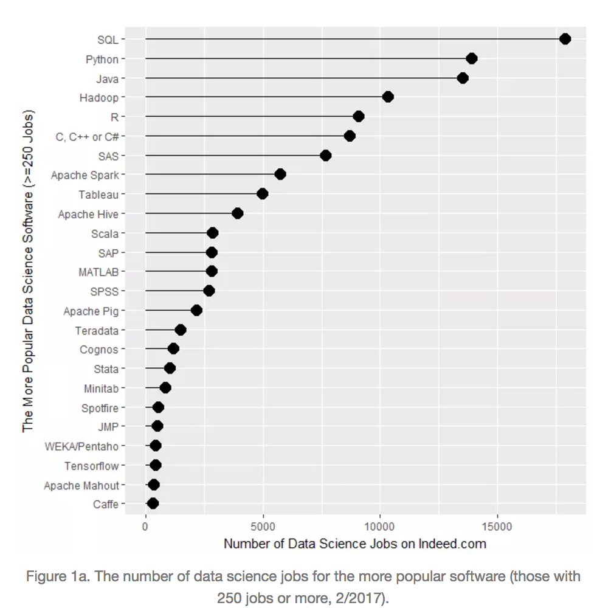
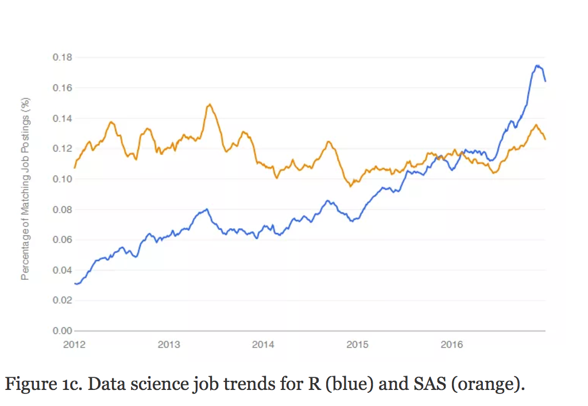
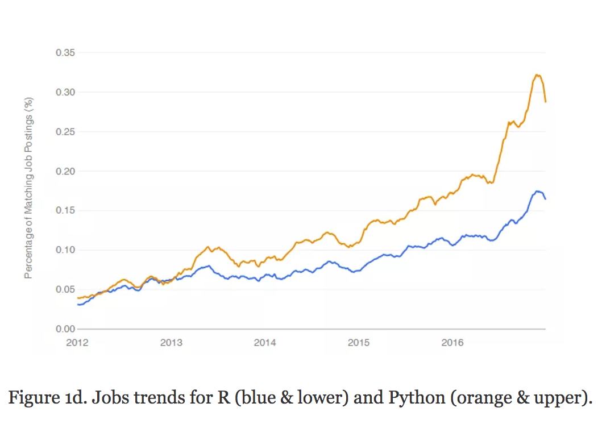
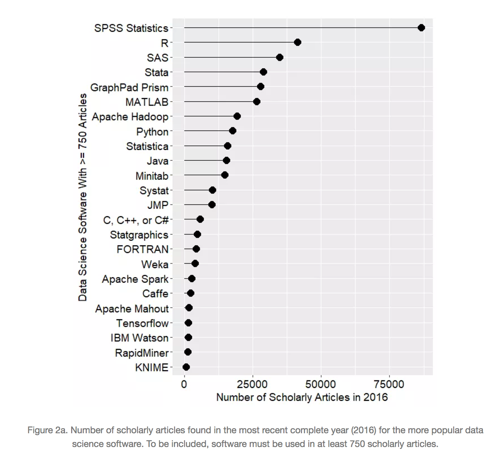
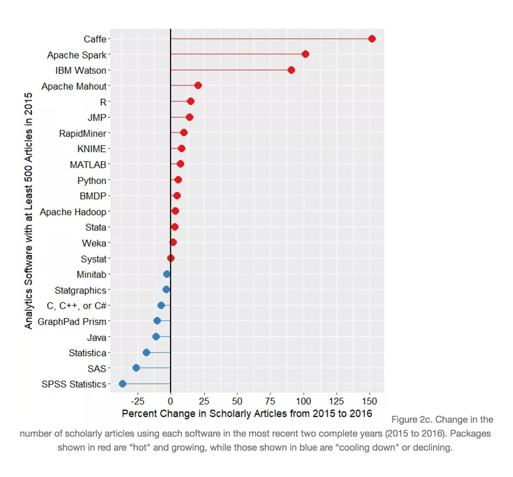
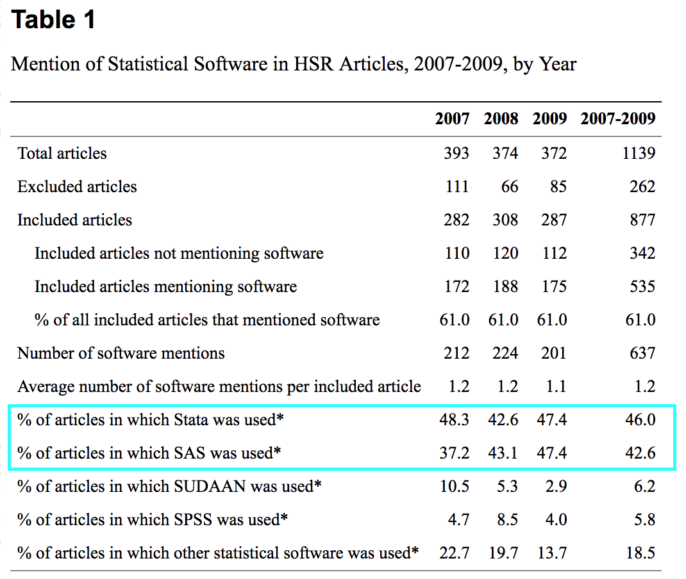

## Statistical computing

  + "Statistical computing"" is sometimes 
  <a href='https://en.wikipedia.org/wiki/Computational_statistics'>defined</a> 
  interchangeably with
  "computational statistics" to describe the interface of statistics 
  and computer science.
  
  + A proposed distinction between these terms defines:
  
    - "Computational statistics" as the application of computer science to statistics
    
    - "Statistical computing" as the design of computational algorithms 
    for implementing methods and the designing methods that harness the power of 
    computing to answer statistical questions.
    
  + This course will be organized around a broader view of statistical computing.

## A broad view of statiscal computing
  
  + This course will take a broader view of statistical computing that
    encompasses the many ways - both routine and specialized - that
    computers are used by statistical analysts and data scientists. 

  + This broad view encompasses but is not limited to: 
  
    - Managing, obtaining, and organizing data
    
    - Data exploration and visualization
    
    - Using statistical software for data analysis
    
    - Reproducible reporting and presentation of analyses
    
    - Computationally intensive methods in statistics and data science
    
## Course Overview

  + Course Website: <a href='www.jbhender.github.io/Stats506'>www.jbhender.github.io/Stats506</a>
  
  + General computing skills: Linux shell, git, markdown
  
  + Scripting Languages: R, Stata, SAS
  
  + "Advanced" R: dplyr, package structure and development, Rcpp 
  
  + Other languages: C++, C, SQL, html
  
  + High performance, parallel, distributed, and asynchronous computing
  
  + Computational algorithms: cross-validation, bootstrap re-sampling, permutation testing,
  Monte Carlo estimation, simulation studies, optimization.
  
## Canvas

  + Reading assignments and quizzes

  + First "quiz" is actually a survey and due this Thursday.

  + For future readings I will always give you at least five days and usually a 
  week or more to complete them.
  
## Optional Texts

 + There are two optional texts for this course, both on using R.
 
 + Neither text is required to complete problem sets or quizzes, but I will
 occasionally include optional readings from these texts to supplement course material.
 
 + _The Art of R Programming_, by Norman Matloff, is recommended for those with 
 little to no previous experience in R.
 
 + _Advanced R_, by Hadley Wickham, is for those who would like to develop a deep
 understanding of R and its inner workings.
    
## Statistical Software

  + Why will we focus on R, SAS, and Stata? 
  
  + These appear to be the most in demand in the job market
  for statistical analysts.

  + For data science jobs, R and Python appear to be the most in demand.
  
  + Other courses devoted exclusively to Python.

## Software Popularity

+ In <a href='http://r4stats.com/articles/popularity/'>
The Popularity of Data Science Software</a>, Robert Muenchen presents
analyses measuring the popularity of various software in job postings and 
academic articles.

+ The plots on the next five slides are screen shots taken from the article.

## Popularity in job postings
<center>
```{r, out.width="400px",echo=FALSE}

```
</center>

## R vs SAS
<center>
```{r, out.width="500px",echo=FALSE}

```
</center>

## R vs Python
<center>
```{r, out.width="500px",echo=FALSE}

```
</center>

## Scholarly articles
<center>
```{r, out.width="500px",echo=FALSE}

```
</center>

## 1-Year Trends for scholarly articles
<center>
```{r, out.width="500px",echo=FALSE}

```
</center>

## Health Services Research

+ In health services research a large majority of academic articles use SAS
or Stata
<a href='https://www.ncbi.nlm.nih.gov/pmc/articles/PMC3205033/?report=classic'>
(Dembe, et al; 2011)</a>

<center>
```{r, out.width="400px",echo=FALSE}

```
</center>

## About (some of) these languages

 + R, SAS, and Stata are examples of domain specific languages used primarily 
 for statistics and data analysis.
 
 + SQL or 'structured query language' is a specialized language for querying 
 databases.
 
 + Python is a general purpose scripting language with a number of libraries
 for math, statistics, and data analysis including: numpy, panda, statsmodels, and sckitlearn.
 
 + System and application languages such as C/C++, Java, and go can be used to 
 produce very high performance code -- but have a larger learning and development curve.


## Note cards

 + On the *lined* side of the notecard, please write:
 
    - Your full name
    - The name by which you prefer to be called and a phonetic rendering if 
      potentially difficult for *me* to pronounce
    - Your uniqname.

 + On the *unlined* side please write just the name by which you prefer to be
 called.
 
 + Note cards will sometimes be used to call on students to answer questions in 
 class.  
