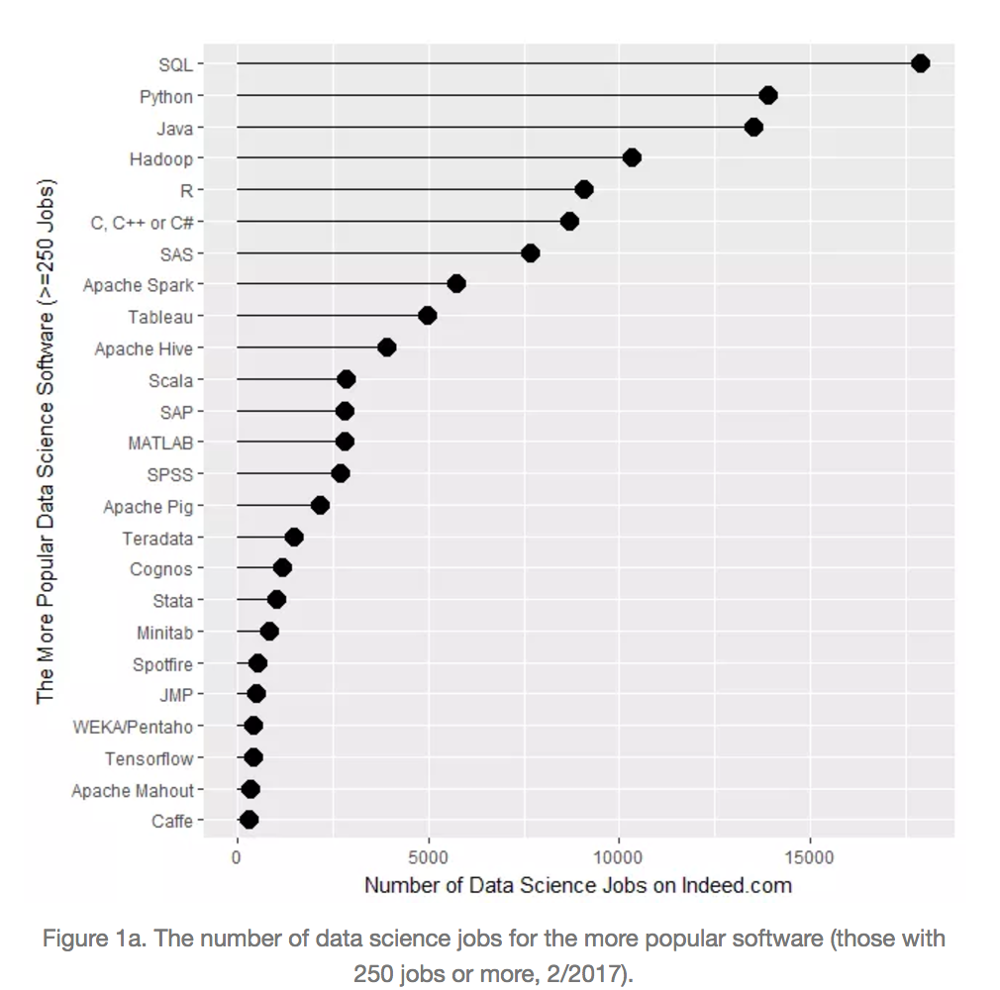
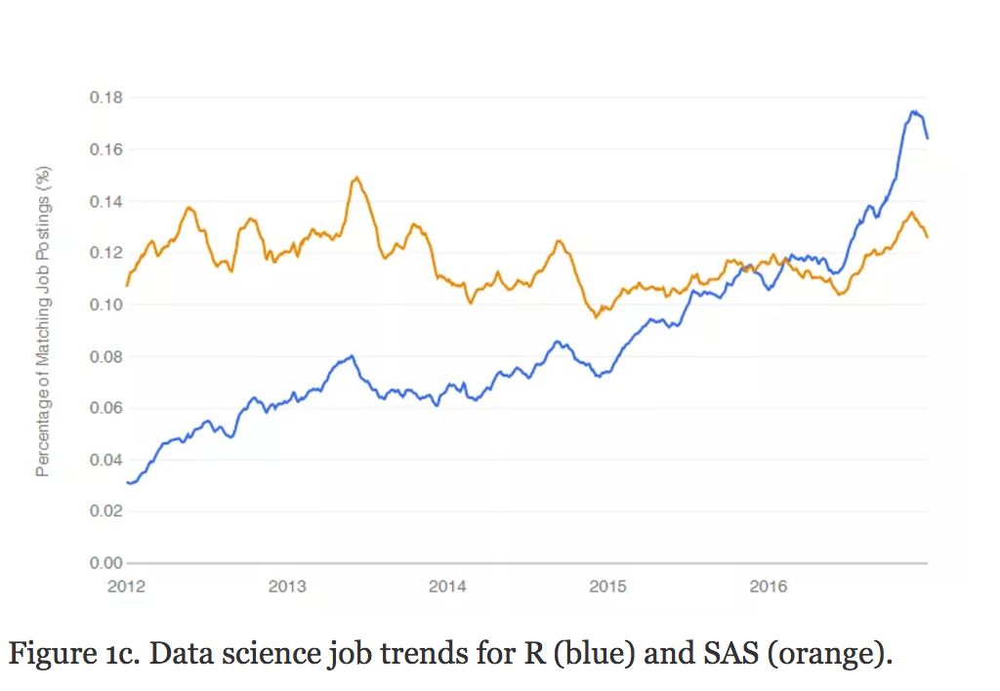
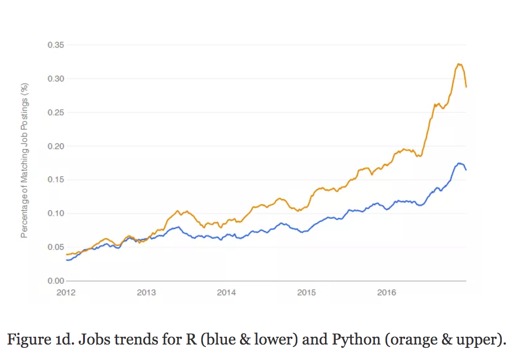
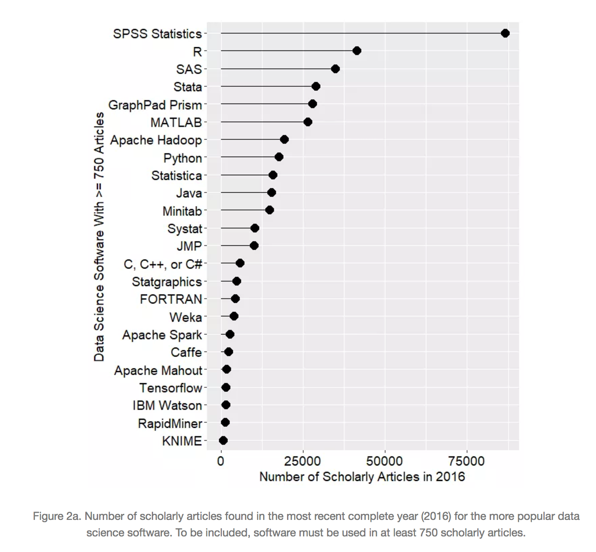
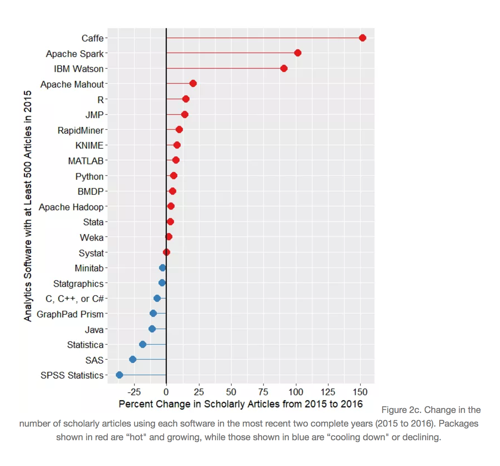
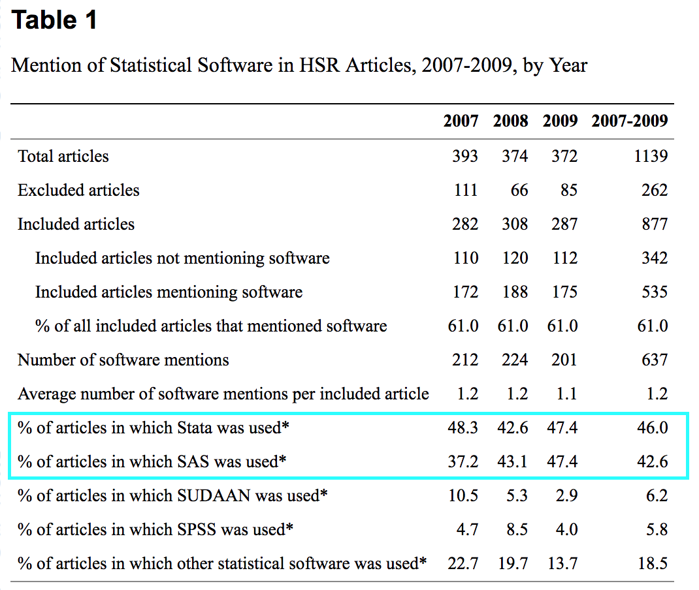

## Computatational Methods and Tools in Statistics
  
  + This course take a broad view of computational methods that
    encompasses the many ways - both routine and specialized - that
    computers are used by statistical analysts and data scientists. 

## Computatational Methods and Tools in Statistics

  + This broad view encompasses but is not limited to: 
  
    - Managing, obtaining, and organizing data
    
    - Data exploration and visualization
    
    - Using statistical software for data analysis
    
    - Reproducible reporting and presentation of analyses
    
    - Computationally intensive methods in statistics and data science
    
## Course Overview

  + Course Website: <a href='www.jbhender.github.io/Stats506/F18'>www.jbhender.github.io/Stats506/F18/</a>
  
  + General computing skills: Linux shell, git, literate programming
  
  + Scripting Languages: R, Stata, SAS
  
  + "Advanced" R: dplyr, data.tables, functional and object oriented programming,
  Rcpp 
  
  + Other languages:  (R)Markdown, html, C++, C, SQL
  
  + High performance and parallel computing
  
  + Computational algorithms: cross-validation, bootstrap re-sampling, permutation testing, Monte Carlo estimation, simulation studies, optimization.
  
## Canvas

  + Reading assignments, quizzes, and surveys

  + First of these is a survey and due this Thursday.
  
  + The second is a quiz and due next Tuesday.

  + For future readings and quizzes I will always 
    give you at least five days and usually a 
    week or more to complete them.
  
## Optional Texts

 + There are two optional texts for this course, both on using R.
 
 + Neither text is required to complete problem sets or quizzes, but I will
 occasionally include optional readings from these texts to supplement course material.
 
 + _The Art of R Programming_, by Norman Matloff, is recommended for those with 
 little to no previous experience in R.
 
 + [Advanced R](https://adv-r.hadley.nz/), by Hadley Wickham, 
 is for those who would like to develop a deep
 understanding of R and its inner workings. You may also his book with 
 Garrett Grolemund, [R for Data Science](http://r4ds.had.co.nz/) useful. 

    
## Statistical Software

  + Why will we focus on R, SAS, and Stata? 
  
  + These appear to be the most in demand in the job market
  for statistical analysts.

  + For data science jobs, R and Python appear to be the most in demand.
  
  + Other courses devoted exclusively to Python.

## Software Popularity

+ In <a href='http://r4stats.com/articles/popularity/'>
The Popularity of Data Science Software</a>, Robert Muenchen presents
analyses measuring the popularity of various software in job postings and 
academic articles.

+ The plots on the next five slides are screen shots taken from the article.

## Popularity in job postings
<center>
```{r, out.width="400px",echo=FALSE}

```
</center>

## R vs SAS
<center>
```{r, out.width="500px",echo=FALSE}

```
</center>

## R vs Python
<center>
```{r, out.width="500px",echo=FALSE}

```
</center>

## Scholarly articles
<center>
```{r, out.width="500px",echo=FALSE}

```
</center>

## 1-Year Trends for scholarly articles
<center>
```{r, out.width="500px",echo=FALSE}

```
</center>

## Health Services Research

+ In health services research a large majority of academic articles use SAS
or Stata
<a href='https://www.ncbi.nlm.nih.gov/pmc/articles/PMC3205033/?report=classic'>
(Dembe, et al; 2011)</a>

<center>
```{r, out.width="400px",echo=FALSE}

```
</center>

## About (some of) these languages

 + R, SAS, and Stata are examples of domain specific languages used primarily 
 for statistics and data analysis.
 
 + SQL or 'structured query language' is a specialized language for querying 
 databases.
 
 + Python is a general purpose scripting language with a number of libraries
 for math, statistics, and data analysis including: numpy, panda, statsmodels, and sckitlearn.
 
 + System and application languages such as C/C++, Java, and go can be used to 
 produce very high performance code -- but have a larger learning and development curve.

  
