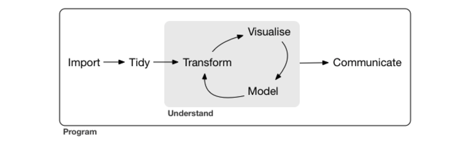

```{r setup, include=FALSE}
knitr::opts_chunk$set(echo = FALSE)
```

[Course Homepage]("./index.html")

## About this page
This page presents a collection of tables organizing commonly used commands from
various statistical programming languages.  The tables are organized according to 
Hadley Wicham's [model](http://r4ds.had.co.nz/introduction.html) for a data science program:

{}

This is a working document which will be updated throughout the course.  If there are
functions here you are unfamiliar with it would be a good idea to read the documentation
in the corresponding languages.

###  Importing Data

|Description | R (base) | R (libraries) | Stata | 
|--------------------------|-------------|-------------|-------------|
| import data in native formats | load() (.RData), data() |-| use (.dta), webuse, sysuse|
| saving data in native formats | save | - | save |
| import delimited data (i.e. csv, tsv) | read.csv(), read.table() | *readr*: read_delim() | import delimited |
| write/export delimited data | write.csv(), write.table() | *readr*: write_delim() | export delimited |

###  Tidy 

|Description | R (base) | R (libraries) | Stata | 
|--------------------------|-------------|-------------|-------------|
| reshape data from wide to long | reshape | **tidyr**: gather, spread | reshape

###  Transform

In the table below, the R functions are designed to work with various rectangular
data structures typified by the `data.frame` and `tibble` classes.  

|Description | R (base) | R (libraries) | Stata | 
|--------------------------|-------------|-------------|-------------|
| create variables | direct assignment: `<-`,`=` | **dplyr**: mutate | generate |
| drop or modify existing variables |  direct assignment of: `<- NULL`, `= NULL` | **dplyr**: mutate, trasnmute | drop, replace, keep
| compute summaries for subgroups | aggregate | **dplyr**: group_by() %>% summarize() | collapse |

### Model
|Description | R (base) | R (libraries) | Stata | 
|--------------------------|-------------|-------------|-------------|
| linear models | lm | - | regress |
| generalized linear models | glm(), family() | - | logit/logistic, poisson, etc.|

### Visualize
|Description | R (base) | R (libraries) | Stata | 

[Course Homepage]("./index.html")